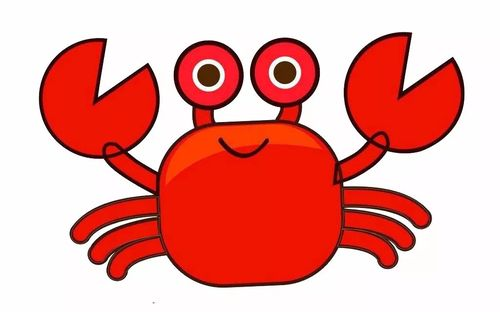
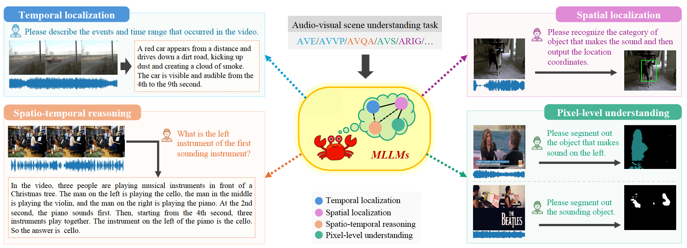
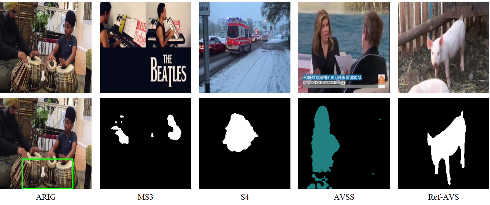

<p align="center">
    
<p>


<h3 align="center"> (CVPR'25) <a href="" style="color:#9C276A">
Crab: A Unified Audio-Visual Scene Understanding Model 
    with Explicit Cooperation</a></h3>


<h5 align="center"> 🚀🚀 Welcome to the repo of Crab! If our project helps you, please give us a star ⭐ on GitHub to support us. 🙏🙏 </h2>

<h5 align="center">


[](https://huggingface.co/ahsgdxhs/Crab) [](https://huggingface.co/datasets/ahsgdxhs/AVUIE) [](https://arxiv.org/pdf/2503.13068) <br>




## 📰 News

* **[2025.03.18]**  👋👋 Release [pretrain, finetune weights](https://huggingface.co/ahsgdxhs/Crab) and [AV-UIE Dataset](https://huggingface.co/datasets/ahsgdxhs/AVUIE).
* **[2025.03.15]**  👋👋 [Project demo video](https://huggingface.co/datasets/ahsgdxhs/AVUIE/blob/main/demo.mp4)
* **[2025.03.15]**  👋👋 Release training, evaluation and inference codes of Crab.
* **[2025.02.27]**  🔥🔥 Crab has been accepted to CVPR 2025.


<div align="center"><video src="https://www.youtube.com/watch?v=O57xewSvOj4" ></div>

<iframe width="560" height="315" src="https://www.youtube.com/embed/O57xewSvOj4?si=4FAoUNCbYBpyWatd" title="YouTube video player" frameborder="0" allow="accelerometer; autoplay; clipboard-write; encrypted-media; gyroscope; picture-in-picture; web-share" referrerpolicy="strict-origin-when-cross-origin" allowfullscreen></iframe>


## 🌟 Unified Audio-Visual Scene Understanding Capabilities

### Temporal Localization
<h4 align="center">  AVE Task </h4>
<div align="center"><video src="https://private-user-images.githubusercontent.com/72310120/422185203-73aba174-7ee3-419e-b775-afff041bacca.mp4?jwt=eyJhbGciOiJIUzI1NiIsInR5cCI6IkpXVCJ9.eyJpc3MiOiJnaXRodWIuY29tIiwiYXVkIjoicmF3LmdpdGh1YnVzZXJjb250ZW50LmNvbSIsImtleSI6ImtleTUiLCJleHAiOjE3NDE4NDIzODUsIm5iZiI6MTc0MTg0MjA4NSwicGF0aCI6Ii83MjMxMDEyMC80MjIxODUyMDMtNzNhYmExNzQtN2VlMy00MTllLWI3NzUtYWZmZjA0MWJhY2NhLm1wND9YLUFtei1BbGdvcml0aG09QVdTNC1ITUFDLVNIQTI1NiZYLUFtei1DcmVkZW50aWFsPUFLSUFWQ09EWUxTQTUzUFFLNFpBJTJGMjAyNTAzMTMlMkZ1cy1lYXN0LTElMkZzMyUyRmF3czRfcmVxdWVzdCZYLUFtei1EYXRlPTIwMjUwMzEzVDA1MDEyNVomWC1BbXotRXhwaXJlcz0zMDAmWC1BbXotU2lnbmF0dXJlPTU4YTFlMGY4NjIzNzE0YzZlZTlkNzYwMTIxOWFhMDE4MzE5Y2Q4Yjk4Zjk4MzA1NDVhMTRlODg3MTY4NTZlMDEmWC1BbXotU2lnbmVkSGVhZGVycz1ob3N0In0.KdZSD0DWTXNSeqibES58yi9NC8KSn0O1xkVr-04hIX0" ></div>
label: Male speech, man speaking, [0,8]

Predict: A man is giving a speech from a podium in a classroom. The man speaks from the beginning of the video until the 8th second. So the audible and visible event in the video is <event> Male speech, man speaking </event>, and the time range is <range> 0,8 </range>.

<h4 align="center"> AVVP Task </h4>
<div align="center"><video src="https://private-user-images.githubusercontent.com/72310120/422185838-473fed2a-b092-450b-a50e-13e3bc471772.mp4?jwt=eyJhbGciOiJIUzI1NiIsInR5cCI6IkpXVCJ9.eyJpc3MiOiJnaXRodWIuY29tIiwiYXVkIjoicmF3LmdpdGh1YnVzZXJjb250ZW50LmNvbSIsImtleSI6ImtleTUiLCJleHAiOjE3NDE4NDI1NDUsIm5iZiI6MTc0MTg0MjI0NSwicGF0aCI6Ii83MjMxMDEyMC80MjIxODU4MzgtNDczZmVkMmEtYjA5Mi00NTBiLWE1MGUtMTNlM2JjNDcxNzcyLm1wND9YLUFtei1BbGdvcml0aG09QVdTNC1ITUFDLVNIQTI1NiZYLUFtei1DcmVkZW50aWFsPUFLSUFWQ09EWUxTQTUzUFFLNFpBJTJGMjAyNTAzMTMlMkZ1cy1lYXN0LTElMkZzMyUyRmF3czRfcmVxdWVzdCZYLUFtei1EYXRlPTIwMjUwMzEzVDA1MDQwNVomWC1BbXotRXhwaXJlcz0zMDAmWC1BbXotU2lnbmF0dXJlPTAyYmY3NzExMjA1MzViOWI1MDAwNDQ5NDBiN2QyNDU5NjNkNzVkZTA3OGQ3NTllZWQ0NjljMmE2NDU4MWVkYjUmWC1BbXotU2lnbmVkSGVhZGVycz1ob3N0In0.KSgw-89gTiXRINLdIgSm3fxhzlbXzXZWqSWwMKSlA5Q" ></div>
Label: 
Audio: Chainsaw, [0,10]  Visual: Chainsaw, [0,1],[3,6],[9,10]

Predict: The video shows a man using a chainsaw to cut a tree. The chainsaw is visible and running from the beginning of the video (0 seconds) to the end (10 seconds). Therefore, visual and audio events are: <visual>Chainsaw,(0 10)</visual> and <audio>Chainsaw,(0 10)</audio>


### Spatio-temporal reasoning

<h4 align="center"> MUSIC-AVQA Task </h4>
<div align="center"><video src="https://private-user-images.githubusercontent.com/72310120/422186495-bbc445fd-fc97-4db1-88f9-6244c230dbde.mp4?jwt=eyJhbGciOiJIUzI1NiIsInR5cCI6IkpXVCJ9.eyJpc3MiOiJnaXRodWIuY29tIiwiYXVkIjoicmF3LmdpdGh1YnVzZXJjb250ZW50LmNvbSIsImtleSI6ImtleTUiLCJleHAiOjE3NDE4NDI3MjAsIm5iZiI6MTc0MTg0MjQyMCwicGF0aCI6Ii83MjMxMDEyMC80MjIxODY0OTUtYmJjNDQ1ZmQtZmM5Ny00ZGIxLTg4ZjktNjI0NGMyMzBkYmRlLm1wND9YLUFtei1BbGdvcml0aG09QVdTNC1ITUFDLVNIQTI1NiZYLUFtei1DcmVkZW50aWFsPUFLSUFWQ09EWUxTQTUzUFFLNFpBJTJGMjAyNTAzMTMlMkZ1cy1lYXN0LTElMkZzMyUyRmF3czRfcmVxdWVzdCZYLUFtei1EYXRlPTIwMjUwMzEzVDA1MDcwMFomWC1BbXotRXhwaXJlcz0zMDAmWC1BbXotU2lnbmF0dXJlPWU3MmE2NzJkYjdiM2FjZWYyMjk5NjhlNDFlZWJlMjA1NTg3YmEzMTY0NjM2NmM5OTk2ZmM5NmE3ODVhOWU0ZWYmWC1BbXotU2lnbmVkSGVhZGVycz1ob3N0In0.p5QQb07__JvCNHTVwGJgymlZTYMOLuAewRjaqJ00GEI"></div>
Question: What is the left instrument of the first sounding instrument? 

Answer: saxophone

Pred: In the video, four men are playing musical instruments. The man on the left is playing the saxophone, the man in the middle is playing the double bass, the man on the right is playing the guitar, and the man in the back is playing the drums. At the beginning of the video, the man in the middle starts playing the double bass first, and then the other instruments start playing. So the instrument on the left of the first sounding instrument is the saxophone. So the answer is <answer> saxophone </answer>.


### Spatial Localization & Pixel-level understanding
<div align="center"> </div>


## 🛠️ Requirements and Installation
Basic Dependencies:
* Python == 3.9
* Pytorch == 2.1.0
* transformers == 4.37.2
* deepspeed == 0.12.6

Install required packages:
```bash
git clone git@github.com:GeWu-Lab/Crab.git
cd Crab
pip install -r requirements.txt
```

Multi-modal Encoder Weights:
- download visual encoder [openai-clip-vit-large-patch14](https://huggingface.co/openai/clip-vit-large-patch14)
- download audio encoder [Fine-tuned BEATs_iter3+ (AS2M)](https://github.com/microsoft/unilm/blob/master/beats/README.md)

LLM Weights:
- download [LLaMA-2-Chat-HF](https://huggingface.co/meta-llama/Llama-2-7b-chat-hf)


## 🚀 Quick Start
1. Download [finetune weights](https://huggingface.co/ahsgdxhs/Crab/blob/main/finetune_weights.bin) in directory `ckpt_dir`, [AVS_finetune_weights](https://huggingface.co/ahsgdxhs/Crab/blob/main/avs_finetune_weights.bin)  and [AVSS_finetune_weights](https://huggingface.co/ahsgdxhs/Crab/blob/main/avss_finetune_weights.bin) in directory `avs_ckpt_dir`;
2. Prepare your test samples in `data/example.json` like this:
```json
[
    {
        "task": "avqa",
        "audio_path": "assets/example/avqa/00006835.mp3",
        "video_path": "assets/example/avqa/00006835.mp4",
        "question": "What is the left instrument of the first sounding instrument?"
    },
    {
        "task": "ave",
        "audio_path": "assets/example/ave/-67UNKFmRLk.mp3",
        "video_path": "assets/example/ave/-67UNKFmRLk.mp4"
    },
    {
        "task": "avvp",
        "audio_path": "assets/example/avvp/6aV6c8mY0lg.mp3",
        "video_path": "assets/example/avvp/6aV6c8mY0lg.mp4"
    },
    {
        "task": "arig",
        "audio_path": "assets/example/arig/audio.wav",
        "image_path": "assets/example/arig/1.jpg"
    },
    {
        "task": "s4",
        "audio_path": "assets/example/s4/audio.wav",
        "image_path": "assets/example/s4/0.jpg",
        "mask_path": "assets/example/s4/0.png"
    },
    {
        "task": "ms3",
        "audio_path": "assets/example/ms3/audio.wav",
        "image_path": "assets/example/ms3/1.jpg",
        "mask_path": "assets/example/ms3/1.png"
    },
    {
        "task": "ref-avs",
        "audio_path": "assets/example/ref-avs/audio.wav",
        "image_path": "assets/example/ref-avs/7.jpg",
        "mask_path": "assets/example/ref-avs/00007.png",
        "exp": "making the loudest sound"
    },
    {
        "task":"avss",
        "audio_path":"assets/example/avss/audio.wav",
        "image_path":"assets/example/avss/0.jpg",
        "mask_path":"assets/example/avss/0.png"
    }
]
```
3. Infer.
- For MUSIC-AVQA task, set `avqa_task = True` and `ckpt_dir = <your ckpt_dir>` in `scripts/quick_start.sh`, then run:
```python
bash scripts/quick_start.sh
``` 
- For S4, MS3 and Ref-AVS tasks, set `<your task> = True` and `avs_ckpt_dir = <your avs_ckpt_dir>`.

- For AVSS task, set `avss_task = True` and `avs_ckpt_dir = <your avss_ckpt_dir>`.


## 🗝️ Training

1. Pretrain
- Use our pre-trained checkpoints:
  Download [audio pretrain checkpoint](https://huggingface.co/ahsgdxhs/Crab/blob/main/audio_pretrain.bin), [visual pretrain checkpoint](https://huggingface.co/ahsgdxhs/Crab/blob/main/visual_pretrain.bin), [segmentation pretrain checkpoint](https://huggingface.co/ahsgdxhs/Crab/blob/main/segmentation_pretrain.bin) in `prtrain_ckpt_dir`;

- Pretrain based on LLaMA-7b-Chat-hf model:
  download image and video pretrain dataset from [Video-LLaVA](https://github.com/PKU-YuanGroup/Video-LLaVA/blob/main/TRAIN_AND_VALIDATE.md);
  download audio pretrain dataset from [AudioCaps](https://github.com/cdjkim/audiocaps);
  download segmentation pretrain dataset from [LVIS](https://github.com/lvis-dataset/lvis-api);

  For visual pretrain, run:
  ```bash
  bash scripts/pretrain/pretrain_visual.sh
  ```
  For audio pretrain, run:
  ```bash
  bash scripts/pretrain/pretrain_audio.sh
  ```
  For segmentation pretrain, run:
  ```bash
  bash scripts/pretrain/pretrain_seg.sh
  ```
  
2. Finetune.
Download [AVUIE dataset annotations](https://huggingface.co/datasets/ahsgdxhs/AVUIE) and raw data from [AVE](https://github.com/YapengTian/AVE-ECCV18), [AVVP](https://github.com/YapengTian/AVVP-ECCV20), [AVS](https://github.com/OpenNLPLab/AVSBench), [Ref-AVS](https://github.com/GeWu-Lab/Ref-AVS), [MUSIC-AVQA](https://github.com/GeWu-Lab/MUSIC-AVQA), [VALOR](https://github.com/TXH-mercury/VALOR), modify the `data_root` in `dataset/unified_dataset.py`;
3. Jointly training on all tasks:
```bash
bash scripts/finetune/finetun_hyper_lora.sh
```
4. Jointly training on AVS tasks

set `finetune_ckpt_dir = <your finetune ckpt dir>` in step 3, then run:
```bash
bash scripts/finetune/finetune_hyper_lora_avs.sh
``` 


## 🤖 Inference
```bash
bash scripts/finetune/inference_hyper_lora.sh
```


## 📑 Citation

If you find Crab useful for your research and applications, please cite using this BibTeX:
```bibtex
@article{du2025crab,
  title={Crab: A Unified Audio-Visual Scene Understanding Model with Explicit Cooperation},
  author={Du, Henghui and Li, Guangyao and Zhou, Chang and Zhang, Chunjie and Zhao, Alan and Hu, Di},
  journal={arXiv preprint arXiv:2503.13068},
  year={2025}
}
```

## 🔒 License

This project is released under the Apache 2.0 license as found in the LICENSE file.
Please get in touch with us if you find any potential violations.
